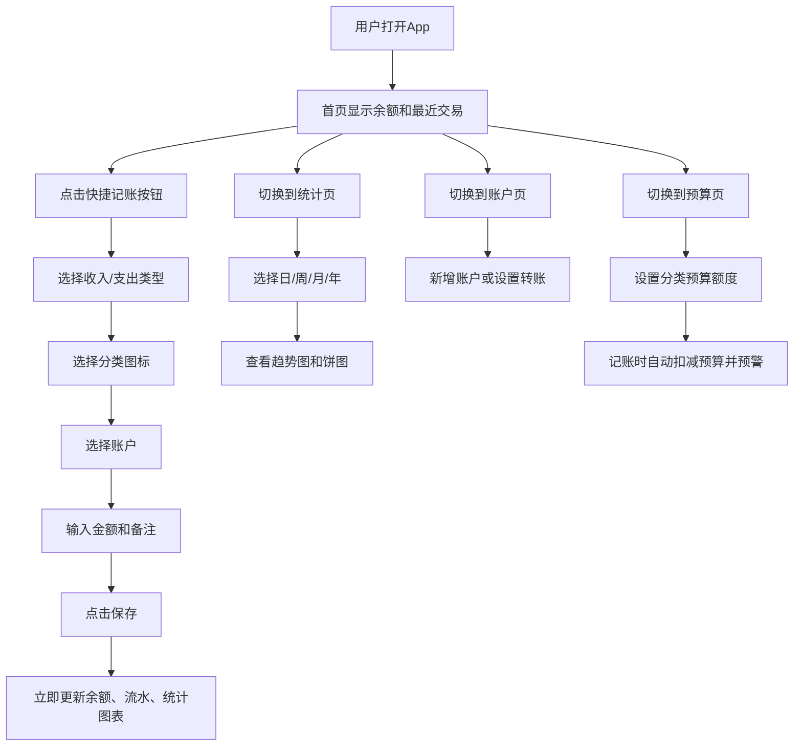

## 1. 产品概述

一款面向个人用户的轻量级记账应用，支持多账户管理、收支分类、预算控制和可视化统计，帮助用户清晰掌握财务状况，养成良好的消费习惯。

- **目标用户**：个人用户、学生、工薪族、家庭主妇
- **核心价值**：记录简单直观、数据一目了然、预算超支提醒
- **部署方式**：纯前端 SPA，PWA 支持手机桌面安装，数据本地持久化

## 2. 核心功能

### 2.1 功能模块

1. **首页（总览）**：账户余额概览、本月收支汇总、最近交易流水、快速记账入口
2. **记账页**：收入/支出切换、分类选择、账户选择、金额输入、备注、日期时间
3. **统计页**：日/周/月/年维度切换、收支趋势折线图、分类占比饼图、排名Top列表
4. **账户页**：多账户列表（现金/银行卡/支付宝/微信等）、账户余额、新增/编辑账户、账户间转账
5. **预算页**：按月设置分类预算、预算进度条、超支预警、剩余额度显示
6. **设置页**：分类管理（增删改）、数据导入导出、清除数据、关于信息

### 2.2 页面详情

| 页面名称 | 模块名称 | 功能描述 |
|---------|---------|---------|
| 首页 | 顶部余额区 | 总资产、本月收入、本月支出三张卡片，带渐变色彩 |
| 首页 | 快捷记账按钮 | 悬浮大按钮，点击弹出记账面板 |
| 首页 | 最近交易 | 最近7条收支记录，支持编辑删除 |
| 首页 | 月度预算概览 | 总预算和已用比例进度条，超支红色高亮 |
| 记账页 | 收支切换 | 顶部Tab切换收入/支出，默认选中支出 |
| 记账页 | 分类网格 | 支出12类、收入6类，图标+文字卡片，选中高亮 |
| 记账页 | 账户选择 | 底部弹出账户列表单选，支持快速新建 |
| 记账页 | 金额输入 | 大号数字键盘或原生输入，实时显示 |
| 记账页 | 日期备注 | 默认今日，可改日期；备注可选填 |
| 统计页 | 维度切换 | 日/周/月/年四个选项卡，默认本月 |
| 统计页 | 趋势图 | 纯SVG折线图，收入绿色、支出红色、结余黄色 |
| 统计页 | 分类饼图 | SVG环形饼图，点击分类查看明细 |
| 统计页 | Top排名 | 支出最多前5分类/前5笔记录 |
| 账户页 | 账户卡片列表 | 渐变背景卡片，显示图标、名称、余额 |
| 账户页 | 账户操作 | 新增账户弹窗、编辑、删除、转账弹窗 |
| 预算页 | 预算列表 | 每个分类进度条，百分比和剩余金额 |
| 预算页 | 设置预算 | 点击分类弹出数字输入设置预算 |
| 预算页 | 总预算卡片 | 汇总所有分类预算，总进度条 |
| 设置页 | 分类管理 | 支出/收入分类增删改，图标选择 |
| 设置页 | 数据管理 | JSON导入/导出按钮，一键清空（二次确认） |

## 3. 核心流程

## 4. 用户界面设计

### 4.1 设计风格

- **整体风格**：温暖清新的「奶油咖」风格，米色 + 焦糖色 + 抹茶绿点缀，柔和不刺眼，适合日常高频使用
- **主色**：暖米色 `#FDF6EC`（背景）、焦糖棕 `#D97706`（主强调色）
- **辅助色**：抹茶绿 `#10B981`（收入）、玫红 `#EF4444`（支出）、天蓝 `#3B82F6`（账户）、薰衣草紫 `#8B5CF6`（预算）
- **按钮风格**：圆角16px，渐变背景，悬浮微放大动效
- **字体**：思源黑体/Noto Sans SC（中文正文）、Geist Mono（金额数字等宽）
- **布局**：底部5项Tab导航（首页/记账/统计/账户/预算）+ 顶部渐变标题栏；卡片式圆角16-24px
- **图标**：Lucide React 线性图标，收入/支出分类加Emoji前缀提升辨识度
- **动画**：卡片进入级联fadeUp、记账成功撒花confetti、饼图环形渐变填充动画、预算进度条渐满效果

### 4.2 页面设计概览

| 页面名称 | 模块名称 | UI 元素 |
|---------|---------|---------|
| 首页 | 余额卡片组 | 三张并排渐变卡片（总资产/收入/支出），数字带动画计数 |
| 首页 | 快速记账按钮 | 右下角大圆形悬浮按钮，焦糖渐变，+号图标，点击波纹 |
| 首页 | 最近交易 | 白卡片，左图标右金额，分类名+备注小字，分隔线柔和灰色 |
| 记账页 | 分类网格 | 4列网格，每格emoji图标+文字，选中态棕色边框+背景 |
| 记账页 | 金额区 | 大号¥前缀加粗数字，输入框下划线动画 |
| 统计页 | 趋势图 | SVG带渐变填充，下方网格细线，hover显示 tooltip |
| 统计页 | 分类饼图 | SVG环形饼图中心显示总金额，legend在右侧 |
| 账户页 | 账户卡片 | 横向渐变彩色卡片，图标大字左对齐，余额右对齐数字加千分位 |
| 预算页 | 进度条 | 圆角条，渐变填充，尾端百分比标签，超支变红 |

### 4.3 响应式

- 桌面优先，最大宽度 480px 居中容器模拟手机端（保持与燃脂食堂一致的移动端优先体验）
- 窗口大于 md (768px) 时自动居中显示手机壳样式
- 触摸优化：按钮最小高度 44px，卡片间距充足，避免误触
- 所有输入框适配手机键盘，日期使用原生日期选择器

