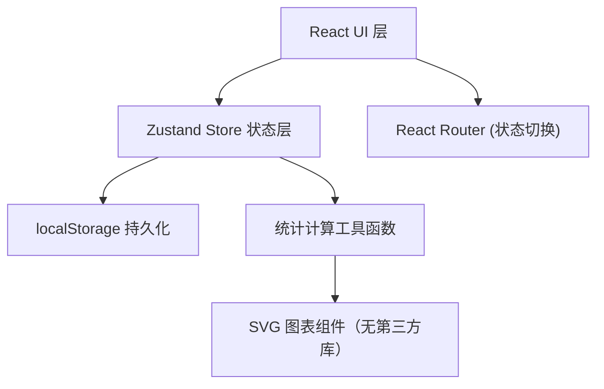
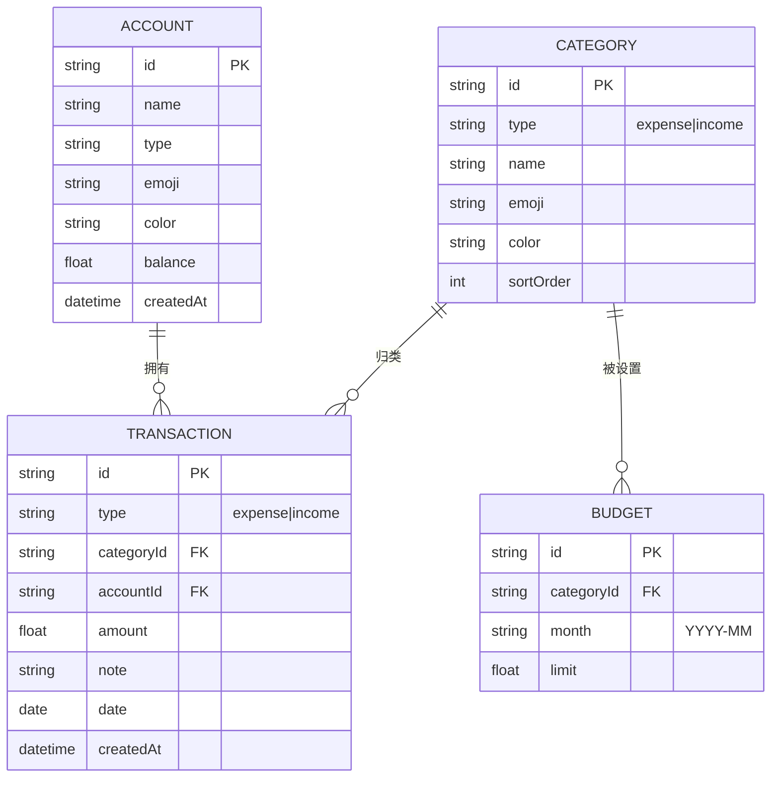

## 1. 架构设计

纯前端单页应用，无后端服务，所有数据通过 Zustand 状态管理 + localStorage 持久化。



## 2. 技术选型

| 层级 | 技术 | 说明 |
|------|------|------|
| 前端框架 | React 18 + TypeScript 5 | 类型安全组件开发 |
| 构建工具 | Vite 6 | 快速开发和构建 |
| 样式 | TailwindCSS 3 + PostCSS | 原子化CSS，自定义暖色主题 |
| 状态管理 | Zustand 4 + persist 中间件 | 轻量，内置 localStorage 持久化 |
| 图标 | Lucide React 0.462 | 线性图标，与燃脂食堂一致 |
| 图表 | 纯 SVG + 自绘组件 | 无第三方图表库，减小体积 |
| PWA | 手写 service-worker + manifest.json | 支持安装到手机桌面 |
| 部署 | GitHub Pages | 免费静态托管 |

## 3. 路由/页面定义

通过 Zustand 中的 `activePage` 状态进行 SPA 页面切换（与燃脂食堂一致，不引入 react-router）：

| 页面 ID | 路径名称 | 目的 |
|---------|---------|------|
| `home` | 首页 | 余额汇总 + 最近交易 + 快捷入口 |
| `record` | 记账 | 收入/支出记录编辑面板 |
| `stats` | 统计 | 趋势图 + 饼图 + Top排名 |
| `accounts` | 账户 | 多账户管理 + 转账 |
| `budget` | 预算 | 分类预算设置与进度 |
| `settings` | 设置 | 分类管理 + 数据导入导出 |

## 4. 数据模型

### 4.1 ER 图



### 4.2 TypeScript 类型定义

```typescript
// 账户类型
export type AccountType = 'cash' | 'bank' | 'alipay' | 'wechat' | 'credit' | 'other';
export interface Account {
  id: string;
  name: string;
  type: AccountType;
  emoji: string;
  color: string; // tailwind gradient 后缀如 "from-amber-400 to-orange-500"
  balance: number;
  createdAt: string;
}

// 交易类型
export type TxType = 'expense' | 'income';
export interface Transaction {
  id: string;
  type: TxType;
  categoryId: string;
  accountId: string;
  amount: number;
  note: string;
  date: string; // YYYY-MM-DD
  createdAt: string;
}

// 分类
export interface Category {
  id: string;
  type: TxType;
  name: string;
  emoji: string;
  color: string;
  sortOrder: number;
}

// 预算
export interface Budget {
  id: string;
  categoryId: string;
  month: string; // YYYY-MM
  limit: number;
}

// 应用状态
export interface AppState {
  accounts: Account[];
  transactions: Transaction[];
  categories: Category[];
  budgets: Budget[];
  activePage: string;
  // actions
  addTransaction: (tx: Omit<Transaction, 'id' | 'createdAt'>) => void;
  updateTransaction: (id: string, tx: Partial<Transaction>) => void;
  deleteTransaction: (id: string) => void;
  addAccount: (acc: Omit<Account, 'id' | 'createdAt'>) => void;
  updateAccount: (id: string, acc: Partial<Account>) => void;
  deleteAccount: (id: string) => void;
  transfer: (fromId: string, toId: string, amount: number, note: string) => void;
  setBudget: (categoryId: string, month: string, limit: number) => void;
  addCategory: (cat: Omit<Category, 'id'>) => void;
  updateCategory: (id: string, cat: Partial<Category>) => void;
  deleteCategory: (id: string) => void;
  setActivePage: (page: string) => void;
  importData: (data: any) => void;
  exportData: () => string;
  clearAll: () => void;
}
```

## 5. 初始化数据

内置默认分类（用户可在设置页修改）：
- **支出类（12）**：餐饮🥘、交通🚗、购物🛒、娱乐🎮、居住🏠、医疗💊、教育📚、通讯📱、服饰👔、旅行✈️、健身💪、其他📝
- **收入类（6）**：工资💰、奖金🎁、兼职💼、投资📈、退款↩️、其他💎

内置默认账户（用户可自定义）：
- 现金💵 ￥0
- 银行卡🏦 ￥0
- 支付宝📱 ￥0
- 微信支付💚 ￥0

## 6. 项目目录结构

```
c:\Users\Administrator\Desktop\记账本
├── index.html
├── package.json
├── vite.config.ts
├── tailwind.config.js
├── postcss.config.js
├── tsconfig.json
├── public/
│   ├── manifest.json
│   ├── favicon.svg
│   └── service-worker.js
└── src/
    ├── main.tsx
    ├── index.css
    ├── App.tsx
    ├── store/
    │   └── useStore.ts       # Zustand 全局状态 + persist
    ├── types/
    │   └── index.ts          # 共享类型定义
    ├── utils/
    │   ├── format.ts         # 金额/日期格式化
    │   └── stats.ts          # 统计聚合计算函数
    ├── components/
    │   ├── BottomNav.tsx     # 底部导航
    │   ├── charts/           # 自绘 SVG 图表
    │   │   ├── LineChart.tsx
    │   │   └── DonutChart.tsx
    │   └── common/           # 共享卡片、按钮、弹窗
    │       ├── Card.tsx
    │       ├── GradientButton.tsx
    │       └── Modal.tsx
    └── pages/
        ├── Home.tsx
        ├── Record.tsx
        ├── Stats.tsx
        ├── Accounts.tsx
        ├── Budget.tsx
        └── Settings.tsx
```

## 7. 关键性能与交互

- **金额更新即时反馈**：新增交易后，首页余额、最近交易、预算进度、统计图表全部瞬时重新计算
- **计算工具函数 memo 化**：使用 `useMemo` 避免列表大时重复聚合
- **SVG 图表轻量**：折线图 30 点以内、饼图 12 扇区以内，无需 D3/echarts
- **动画**：卡片进入 `animate-slide-up + delay-*` 级联，记账成功 confetti 效果（Canvas 轻量实现）
- **移动端安全区适配**：iOS 底部横线 `pb-[env(safe-area-inset-bottom)]`

